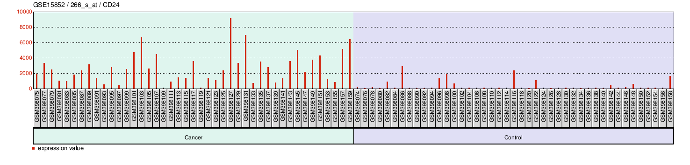

```{r setup, include=FALSE}
knitr::opts_chunk$set(echo = TRUE)
```
```{r load-libraries}

library(ggplot2)

```

# ABSTRACT
Cancer develops when normal cells begin to grow and divide in an unregulated way, often due to mutations that change how genes are expressed. Studying gene expression differences between normal and cancerous tissues can help researchers better understand which genes may contribute to tumor development. This project used the GSE15852 dataset, which contains 86 breast tissue samples collected from Malaysian patients, to compare gene expression patterns between 43 normal and 43 cancerous breast tissue samples. The main focus of this analysis was the expression of CD24, a cell surface protein commonly found in immune and epithelial cells and previously linked to cancer progression. Using R and the limma package, gene expression values were processed, normalized, and statistically tested to identify differences between the two tissue types. The results of this computational analysis showed clear differences in gene expression between normal and cancerous tissues, including changes in CD24 expression. These findings support further exploration into the role of CD24 in breast cancer biology and demonstrate how publicly available datasets can be used to investigate important questions in cancer research.

# BACKGROUND
Cancer occurs when there is unregulated cell proliferation in an otherwise healthy cell that often spreads to other areas of the body (National Cancer Institute, 2021). This unregulated growth occurs as a result of mutations in genetic material that encodes for protein synthesis, or lack thereof. There are upwards of 20,000 genes in the human genome (American Psychological Association, 2024) each of which are subject to mutations which may or may not result in a cell becoming cancerous. Research surrounding gene expression levels has allowed scientists to better understand the nature of cancer and mutations. For example, tumor protein 53 gene (TP53) is a gene that encodes for the p53 gene. P53 is so widely recognized as being under expressed in cancerous tissues that it has earned the name of "Guardian of the Genome”. There are a plethora of genes that could be analysed, however, this computational analysis will use the GSE15852 data set to dissect gene expression of Cluster of Differentiation 24 (CD24). CD24 is a cell surface protein that is commonly expressed by immune, epithelial, neural, and muscle cells (Panagiotou, 2022). 

# STUDY QUESTION AND HYPOTHESIS

## QUESTIONS
Does the expression of genes that encode for CD24 molecules (C24 genes) vary in cancerous breast tissue compared to normal breast tissue?

## HYPOTHESIS
The expression of CD24 will vary between the two tissue samples. 

## PREDICTION
CD24 genes will be expressed at a higher rate in cancerous tissues than in normal tissue samples on average. 

# METHODS
This computational analysis utilized the GSE15852 dataset obtained from the Gene Expression Omnibis (GEO) database. This data set includes tissue gene expression from 86 tissue samples. This includes 43 normal (control/healthy) breast tissue samples and 43 matched breast cancer tissue samples. A pairwise comparison between the healthy and malignant tissues was made to gain a better understanding of gene expression. All analyses were conducted in Posit Cloud using R version 4.3.3 where both Bioconductor and GEOquary packages were used to retrieve the expression matrix and platform annotation of the data set. A Log2 transformation was applied to stabilize the variance across expression levels. 

Samples in the data set were assigned to either "normal" or "tumor" groups based on the metadata provided by the GEO Series Matrix file. A design matrix representing the two groups was generated wising the limma pipeline. This pipeline fits linear models to each gene allowing the assessment of systemic differences between the two groups. In order to account for false-positive findings, the Bonferroni multiple test correction was used to adjust the P-values. Genes were considered significantly differently expressed if they met both the adjusted p-value threshold and a biologically relevant log2 fold-change. 

Visualization of this analysis was done using a p-value histogram to compare each sample (either cancerous or control) to observe the difference in expression level of CD24. In order to further observe differences between cancerous and control gene expression, volcano plot was used to visualize all the genes in the data set. 

# ANALYSIS
```{r pressure, eval=TRUE}
# Version info: R 4.2.2, Biobase 2.58.0, GEOquery 2.66.0, limma 3.54.0
################################################################
#   Data plots for selected GEO samples
if (!require("BiocManager", quietly = TRUE))
  install.packages("BiocManager")

BiocManager::install("GEOquery")
library(GEOquery)
if (!require("BiocManager", quietly = TRUE))
  install.packages("BiocManager")

BiocManager::install("limma")
library(limma)
install.packages("umap")
library(umap)

# Version info: R 4.2.2, Biobase 2.58.0, GEOquery 2.66.0, limma 3.54.0
################################################################
#   Differential expression analysis with limma
library(GEOquery)
library(limma)
library(umap)

# load series and platform data from GEO

gset <- getGEO("GSE15852", GSEMatrix =TRUE, AnnotGPL=TRUE)
if (length(gset) > 1) idx <- grep("GPL96", attr(gset, "names")) else idx <- 1
gset <- gset[[idx]]

# make proper column names to match toptable 
fvarLabels(gset) <- make.names(fvarLabels(gset))

# group membership for all samples
gsms <- paste0("01010101010101010101010101010101010101010101010101",
               "010101010101010101010101010101010101")
sml <- strsplit(gsms, split="")[[1]]

# log2 transformation
ex <- exprs(gset)
qx <- as.numeric(quantile(ex, c(0., 0.25, 0.5, 0.75, 0.99, 1.0), na.rm=T))
LogC <- (qx[5] > 100) ||
  (qx[6]-qx[1] > 50 && qx[2] > 0)
if (LogC) { ex[which(ex <= 0)] <- NaN
exprs(gset) <- log2(ex) }

# assign samples to groups and set up design matrix
gs <- factor(sml)
groups <- make.names(c("Normal Breast Tissue","Tumor Breast Tissue"))
levels(gs) <- groups
gset$group <- gs
design <- model.matrix(~group + 0, gset)
colnames(design) <- levels(gs)

gset <- gset[complete.cases(exprs(gset)), ] # skip missing values

fit <- lmFit(gset, design)  # fit linear model

# set up contrasts of interest and recalculate model coefficients
cts <- paste(groups[1], groups[2], sep="-")
cont.matrix <- makeContrasts(contrasts=cts, levels=design)
fit2 <- contrasts.fit(fit, cont.matrix)

# compute statistics and table of top significant genes
fit2 <- eBayes(fit2, 0.01)
tT <- topTable(fit2, adjust="fdr", sort.by="B", number=250)

tT <- subset(tT, select=c("ID","adj.P.Val","P.Value","t","B","logFC","Gene.symbol","Gene.title","Gene.ID"))

# Visualize and quality control test results.
# Build histogram of P-values for all genes. Normal test
# assumption is that most genes are not differentially expressed.
tT2 <- topTable(fit2, adjust="fdr", sort.by="B", number=Inf)

# summarize test results as "up", "down" or "not expressed"
dT <- decideTests(fit2, adjust.method="fdr", p.value=0.05, lfc=0)

# Volcano plot (log P-value vs log fold change)
colnames(fit2) # list contrast names
ct <- 1  # choose contrast of interest
dT <- topTable(fit2, coef = ct, number = Inf, adjust.method = "BH")

# Define thresholds
logFC_cutoff <- 1
adjP_cutoff <- 0.05

# Assign colors based on thresholds
dT$color <- "grey"  # default
dT$color[dT$logFC >  logFC_cutoff & dT$adj.P.Val < adjP_cutoff] <- "pink"    # upregulated
dT$color[dT$logFC < -logFC_cutoff & dT$adj.P.Val < adjP_cutoff] <- "purple"   # downregulated

# Clean up the contrast name (remove periods)
contrast_name <- gsub("\\.", " ", colnames(fit2)[ct])
contrast_name <- gsub("-", " and ", contrast_name)



# Draw volcano plot
with(dT, plot(logFC, -log10(adj.P.Val),
              pch = 20,
              col = color,
              main = paste("Gene Expression from GSE15852:", contrast_name),
              xlab = "log2 Fold Change",
              ylab = "-log10 Adjusted P-value"))

# Add legend
legend("bottomleft",
       legend = c("Upregulated", "Downregulated", "Not significant"),
       col = c("pink", "purple", "grey"),
       pch = 20,
       bty = "n")

```

# RESULTS
The p-value histogram embedded in the code shows that on average, there is decreased regulation of CD24 molecules resulting in higher levels of expression in cancerous tissue. However, it also highlighted that there were some exeptions to this pattern. Further analysis was needed to better understand the causes of cancer in each sample. The volcano plot highlights each of the 12,413 genes identified in the GSE15852 data set. There are over regulation and under regulation of different genes which in turn supports the idea that cancer biology is complex and often differs case by case. 

# DISCUSSION
The goal of this analysis was to determine whether the expression of CD24 differs between cancerous and normal breast tissue samples in order to gain a better understanding of gene expression and the development of cancer. It was previously predicted that the expression levels of CD24 would be increased in cancerous tissue when compared to noncancerous or normal tissue samples. This prediction was made in light of previous literature written about molecules with similar roles to CD24 such as ICAM-1 (Roland et al., 2007). 

The analysis compared 43 tissue samples collected from cancerous breast tissue and normal breast tissue using Bioconductor, limma, and GEOquary data bases to determine whether or not the GSE15852 data set shows a correlation between the expression of CD24 levels and the development of cancerous cells. The Bonferroni multiple test correction was used to adjust the P-values to avoid observing false negatives in the data set. 

When the code was ran, two plots were used to visualize the trends observed. When simply discussing the regulation of CD24 production, there was a noticeable difference in gene expression between cancerous tissue and healthy tissue. However, not all the tissue samples followed this pattern. Further analysis was needed to gain a better understanding of gene expression of all 12,413 genes observed in the GSE15852 data set. This was done by utilizing a volcano plot to gain a better understanding of the patterns across all genes. The volcano graph highlighted the difference of regulation and expression in many genes. This supports what is already known about cancer biology and that it is a complex disease that often varies from each individual and possibly each cancerous cell. 


# CONCLUSION
Cancer and cancer biology has, and will continue to baffle scientists from around the world due to the nature of its complexity. This computational analysis aimed to answer whether or not the expression of genes that encode for CD24 molecules (C24 genes) vary in cancerous breast tissue compared to normal breast tissue? Through R-based computational analysis and the limma statistical framework, clear global differences in gene expression were identified between the two tissue groups. These transcription distinctions reflect the molecular complexity of breast cancer and provide a foundation for evaluating the role of specific bio-markers such as CD24.

While additional analysis may be needed to confirm the magnitude and direction of CD24-related expression changes, the study demonstrates the value of computational genomics in exploring cancer biology. By leveraging publicly available data sets, researchers can efficiently test hypotheses, identify potential bio-markers, and generate insights that may contribute to improved diagnostic or therapeutic strategies. Overall, this analysis supports the broader understanding that breast cancer involves widespread gene expression dysregulation, and CD24 remains a relevant molecule for continued investigation.


# REFERENCES
American Psychological Association. (2024, May 21). What is a gene? In MedlinePlus Genetics. U.S. National Library of Medicine. https://medlineplus.gov/genetics/understanding/basics/gene/

National Cancer Institute. (2021, October 11). What is cancer? In Understanding Cancer. U.S. Department of Health and Human Services. https://www.cancer.gov/about-cancer/understanding/what-is-cancer

OpenAI. (2025). ChatGPT (version 5.1) [Large language model]. https://chat.openai.com/

Panagiotou, E., Syrigos, N. K., Charpidou, A., Kotteas, E., & Vathiotis, I. A. (2022). CD24: A Novel Target for Cancer Immunotherapy. Journal of personalized medicine, 12(8), 1235. https://doi.org/10.3390/jpm12081235

Roland, C. L., Harken, A. H., Sarr, M. G., & Barnett Jr, C. C. (2007). ICAM-1 expression determines malignant potential of cancer. Surgery, 141(6), 705-707.

Sorrell, A. D., Espenschied, C. R., Culver, J. O., & Weitzel, J. N. (2013). Tumor protein p53 (TP53) testing and Li-Fraumeni syndrome : current status of clinical applications and future directions. Molecular diagnosis & therapy, 17(1), 31–47. https://doi.org/10.1007/s40291-013-0020-0
